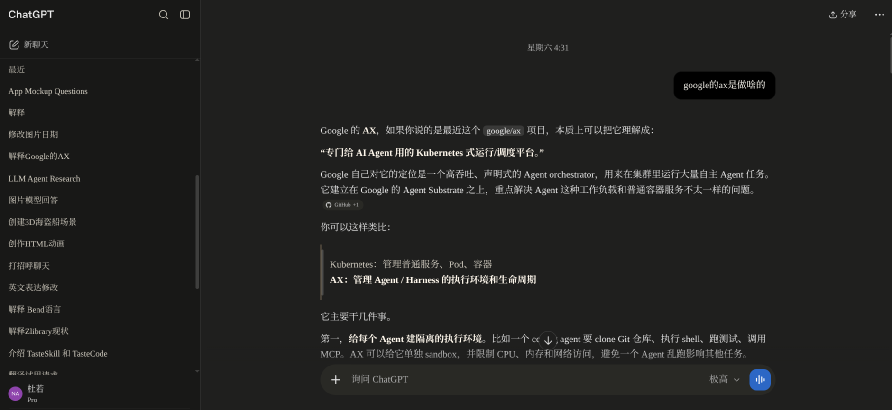

# ChatGPT UI Scripts

A personal collection of ChatGPT web enhancement scripts by duro.

[中文](README.md) | English

## Preview

This repository contains two main enhancements:

| File | Type | Purpose |
| --- | --- | --- |
| `GPT Claude-like Style.user.css` | Stylus/UserStyle | Dark UI theme for ChatGPT that brings the page closer to Claude's narrow, warm-gray, low-distraction reading experience. |
| `chatgpt-claude-like-separator.user.js` | Tampermonkey userscript | Companion to the style: detects plain-text separator paragraphs in replies and adds a class so the style can render them as natural dividers. |

The repo also includes one extra script:

| File | Type | Purpose |
| --- | --- | --- |
| `chatgpt-project-source-preview.user.js` | Tampermonkey userscript | Previews `.md` / `.txt` files inside ChatGPT project sources instead of downloading them on click. |

## Installation

### Stylus style

Recommended (auto-update from GitHub):

1. Install the Stylus browser extension.
2. Open the raw file URL: `https://raw.githubusercontent.com/Duro02/chatgpt-ui-scripts/main/GPT%20Claude-like%20Style.user.css`
3. Stylus shows an install page — click Install.

Or manually:

1. Install the Stylus browser extension.
2. Create a new style.
3. Paste the contents of `GPT Claude-like Style.user.css`.
4. Open `https://chatgpt.com/`.

### Tampermonkey scripts

1. Install the Tampermonkey browser extension.
2. Create a new script.
3. Paste the contents of each `.user.js` file you want to use.
4. Save and refresh the ChatGPT page.

Suggested combinations:

- Appearance only: install `GPT Claude-like Style.user.css`.
- More reliable divider lines inside the theme: also install `chatgpt-claude-like-separator.user.js`.
- Preview project-source Markdown/text files: install `chatgpt-project-source-preview.user.js`.

## Features

### ChatGPT Claude-like Style

- Warm-gray dark theme.
- Narrower reading column for prose.
- Claude-like text, code blocks, quote blocks, and divider styling.
- Tries not to disturb ChatGPT's original layout nodes so it coexists with other scripts.
- Supports all three ChatGPT frontend variants: the legacy `html.dark` marker, the newer `html[data-color-scheme="dark"]` marker, and the logged-in app's `html[data-theme="dark"]` marker.

### ChatGPT Claude-like Separators

- Scans ChatGPT replies for plain-text separator paragraphs.
- Adds the `claude-like-separator` class to matching paragraphs.
- The Stylus style handles the final visual rendering.

### ChatGPT Conversation Navigator (archived)

File lives at `archived/chatgpt-conversation-navigator.user.js`. It is a modified version of YukonKong's `ChatGPT体验增强插件`, offering long-conversation timeline navigation, a prompt manager, conversation backup, and more.

Current status: ChatGPT has since shipped its own conversation-anchor nodes, so this script's update priority is lowered and **it is not guaranteed to work** — kept for archival purposes only.

Changes in this modified version relative to the original:

- Uses `conversation-turn-*` wrappers as timeline anchors for long conversations.
- Adapts to ChatGPT's virtualized DOM to reduce jump misalignment in long conversations.
- Adds a Prompt manager with naming, categories, save, and append-to-input.
- Adds per-conversation backup and improved scrolling capture for long conversations.
- Marks branch conversations in the chat list and right-side timeline, distinguishing "branches from edited user messages" and "branches from regenerated answers".
- Supports clicking `Index Missing` to backfill preview text and branch markers for uncached nodes in long conversations.
- Removes the original GreasyFork auto-update URL so the modified version is not overwritten by upstream updates.

Usage:

- The right-side dot timeline jumps to the corresponding user question.
- Click the right-side list button to expand the conversation list; search and jump by index or text.
- For long or old conversations, click `Index Missing` to have the script scroll-scan uncached nodes and backfill previews and branch status.
- Long-press a timeline dot to manually flag it as important; long-press again to unflag.
- The prompt-manager button at the bottom right saves common prompts by category and appends them to the input box.
- The backup button exports the current conversation as Markdown; long conversations reuse existing backups and only scan the unbacked-up portion.

Color legend:

- Gray dot: normal conversation node.
- Yellow dot: manually flagged node.
- Blue dot / `2/2` blue label: the user question has branches created by edits and resends.
- White dot / `A 2/2` white label: the GPT answer has branches created by regeneration.
- Yellow + blue: manually flagged and has a user-question branch.
- Yellow + white: manually flagged and has an answer branch.
- Blue + white: the same turn has both a user-question branch and an answer branch.
- Yellow + blue + white: the node has a manual flag, a user-question branch, and an answer branch.

## License and attribution

- `archived/chatgpt-conversation-navigator.user.js` (archived) is modified from YukonKong's original script, which is licensed under `CC-BY-NC-4.0`. This modified version keeps the original author's attribution and the same license restrictions — use and redistribution only within what the license permits, especially the non-commercial clause.
- `GPT Claude-like Style.user.css`, `chatgpt-claude-like-separator.user.js`, and `chatgpt-project-source-preview.user.js` are written by duro. Unless a file states otherwise, they are released under the `MIT` license.

Original script source:

- `ChatGPT体验增强插件` by YukonKong
- GreasyFork update URL: `https://update.greasyfork.org/scripts/570234/ChatGPT%E4%BD%93%E9%AA%8C%E5%A2%9E%E5%BC%BA%E6%8F%92%E4%BB%B6.user.js`

## Notes

ChatGPT's DOM changes quickly, and all these scripts depend on the current page structure. If a feature suddenly stops working, you usually need to re-check the relevant DOM nodes or request paths with the browser's developer tools.
